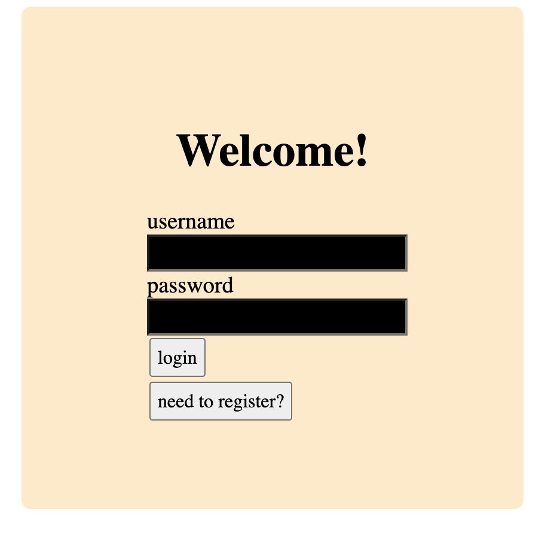
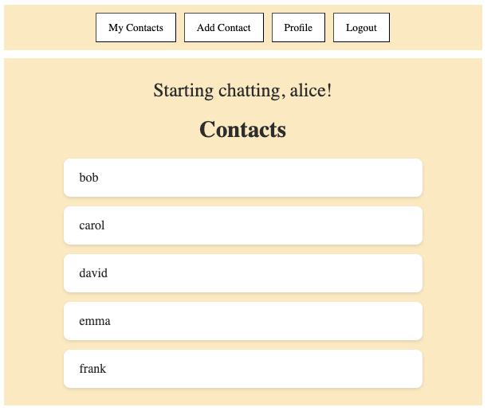
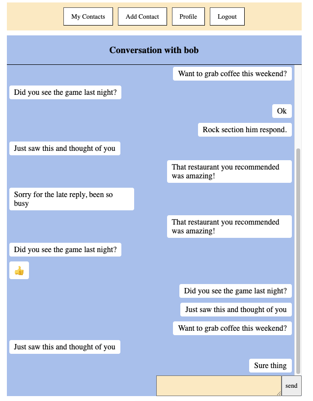
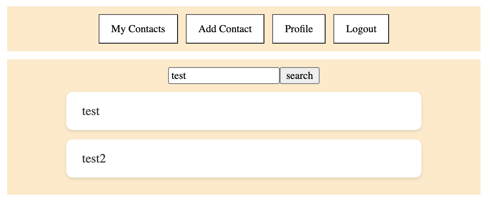
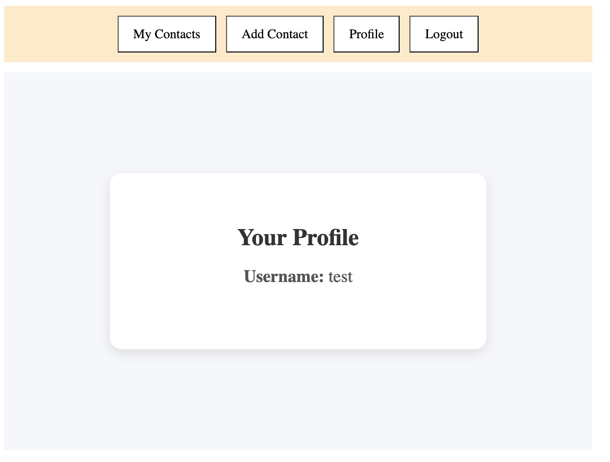

# MessageApp
Simple messaging application that supports contacts and stable message history. 

# To run
Clone into local environment.
```bash
git clone github.com/dan-willia/message-app
```

Change into backend dir and start backend server.
```bash
cd backend/
flask --app message_app run
```

This flask command creates six fake accounts with message history.
```bash
flask --app message_app seed-data
```

Change into my-app dir and start front end server.
```bash
cd ../my-app/
npm run dev
```

Go to [localhost:5173](http://localhost:5173/)

## Login page


## User landing page


## Chat page


## Search page


## Profile page
